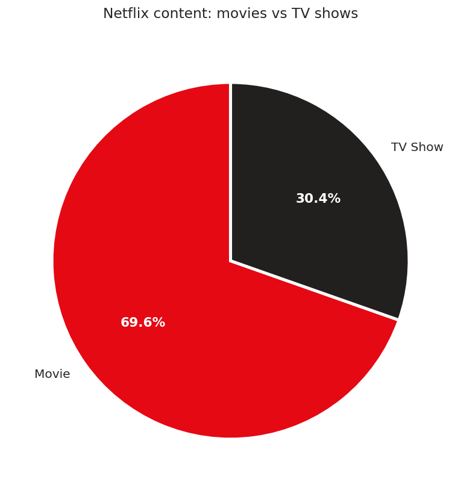
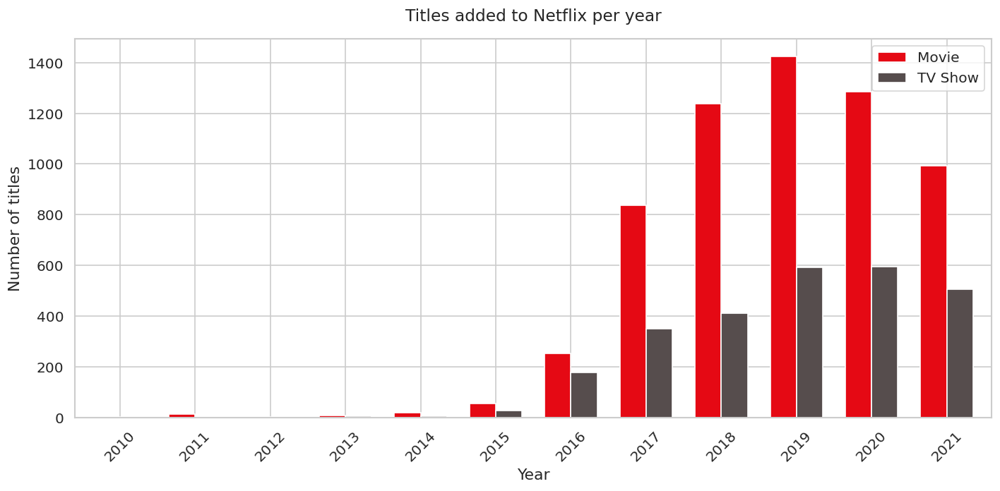
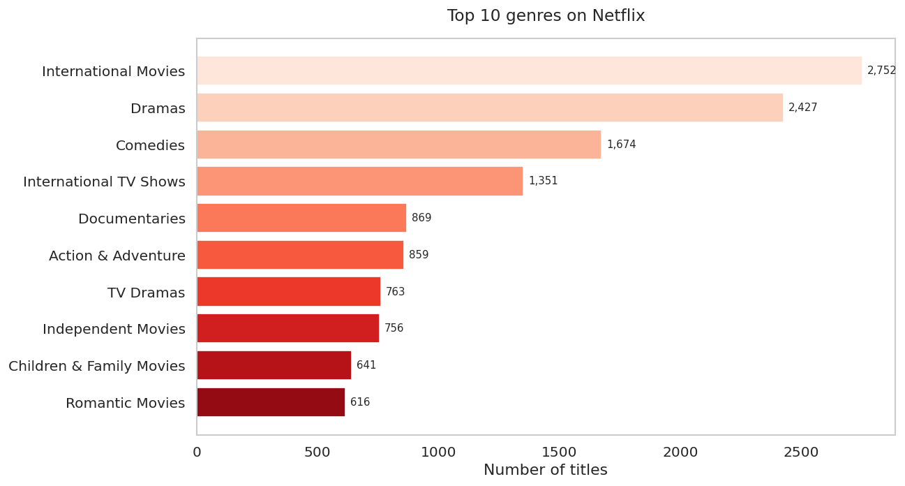
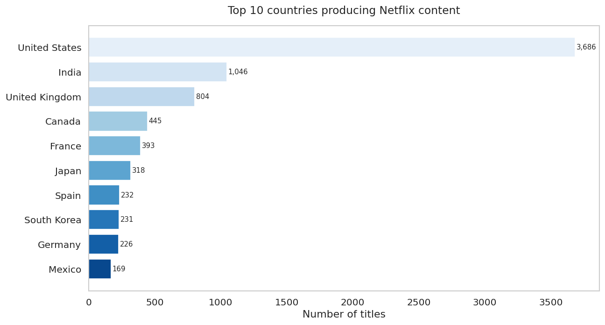
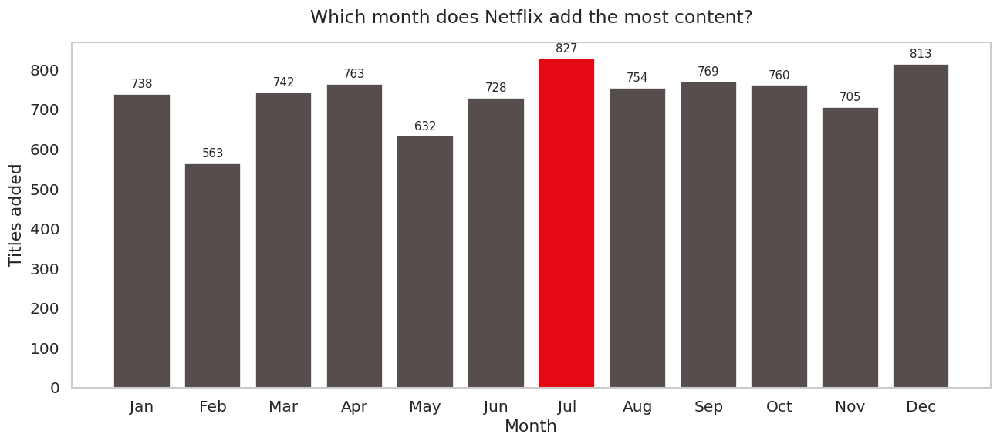
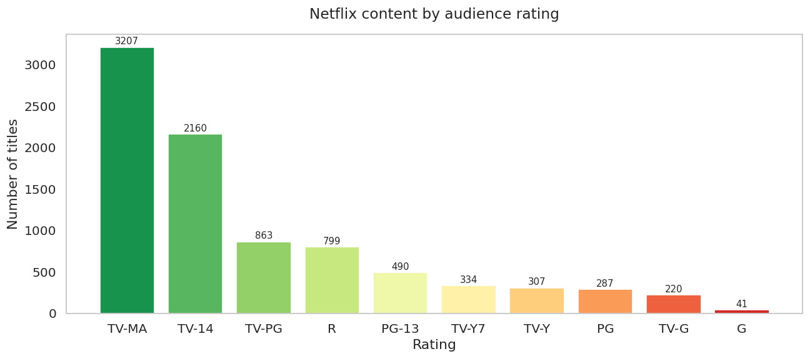
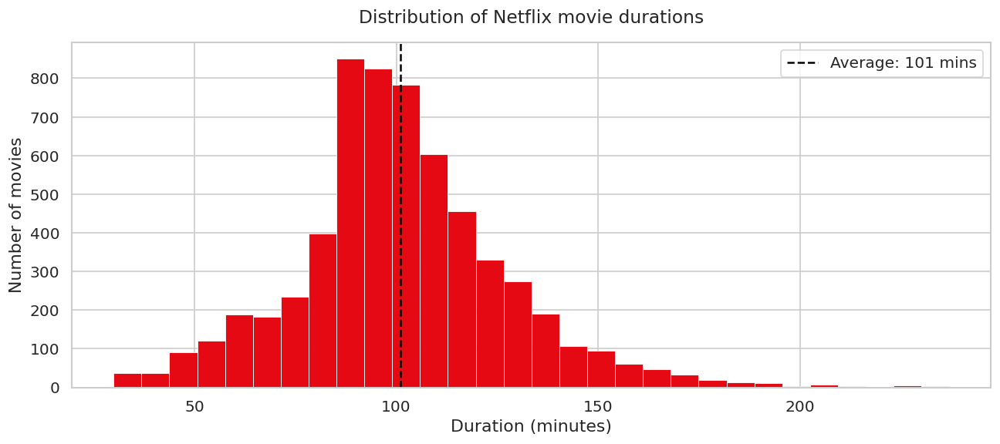

# Netflix Content Strategy — EDA & Business Recommendations

**Data Analyst Portfolio Project**  
Hugo Apolinário · 2025


---

## Table of contents
1. [About the project](#about-the-project)
2. [Dataset](#dataset)
3. [Methodology](#methodology)
4. [Key findings](#key-findings)
5. [Business recommendations](#business-recommendations)
6. [How to run](#how-to-run)
7. [Technologies used](#technologies-used)
8. [License](#license)

---

## About the project

Netflix has over 200 million subscribers globally. Every content decision —
what to produce, when to release it, which markets to target — carries
significant financial risk.

This project analyses **8,800+ Netflix titles** to answer one core business
question:

> **What types of content should Netflix invest in to maximise audience
> reach and satisfaction?**

Rather than simply describing the data, this analysis translates every
finding into a concrete strategic recommendation — the kind of output a
data analyst would deliver to a content strategy team.

---

## Dataset

| Property | Detail |
|---|---|
| Source | Netflix Movies and TV Shows |
| Provider | Kaggle (shivamb) |
| Titles | 8,800+ |
| Columns | 12 (title, type, country, rating, genre, date added, etc.) |
| Time range | 2008 – 2021 |
| Link | [Kaggle Dataset](https://www.kaggle.com/datasets/shivamb/netflix-shows) |

---

## Methodology

**Data cleaning (Python + Pandas):**
- Identified and handled missing values across 6 columns
  (director, cast, country, rating, date added, duration)
- Converted `date_added` to datetime format and extracted
  year and month as separate features
- Normalised multi-value columns (genres, countries) by
  splitting comma-separated strings into individual rows
- Separated movies and TV shows into distinct DataFrames
  for type-specific analysis
- Removed duration outliers (films under 30 or over 250 minutes)

**Analysis approach:** Exploratory data analysis (EDA) focused on
content composition, growth trends, genre distribution, geographic
production, release timing, audience ratings, and movie duration.

---

## Key findings

### 1. Movies vs TV shows


Contrary to popular assumption, **movies make up the majority of
Netflix's catalogue** — a finding that surprised most viewers who
associate Netflix with binge-worthy TV series.

---

### 2. Content growth over time


Netflix's content library grew explosively between **2015 and 2019**,
peaking in 2019. Growth slowed after 2019, likely reflecting a strategic
shift from volume to quality, and the impact of COVID-19 on production
schedules.

---

### 3. Top genres


**International Movies and Dramas** dominate the catalogue by a
significant margin, reflecting Netflix's global expansion strategy.
Comedies and International TV Shows follow, confirming strong appetite
for cross-border content.

---

### 4. Top producing countries


The **United States** leads production by a wide margin, but India,
the United Kingdom, Japan and South Korea are all significant contributors
— signalling Netflix's investment in regional content as a growth lever.

---

### 5. Monthly release patterns


Content additions are not evenly distributed. Certain months see
significantly higher catalogue additions, suggesting deliberate release
scheduling to align with subscriber acquisition windows.

---

### 6. Audience ratings


**TV-MA (mature audiences)** is the dominant rating, confirming that
Netflix's core audience is adults. Family-friendly content (TV-G, TV-Y)
represents a much smaller share — a potential gap in the strategy.

---

### 7. Movie duration


The average Netflix movie runs approximately **90–100 minutes** — closely
aligned with the traditional cinema sweet spot. Very few titles fall
outside the 70–130 minute range, suggesting strong editorial consistency
in film length.

---

## Business recommendations

Based on the analysis, here are five strategic recommendations for
Netflix's content team:

**1. Rebalance toward TV shows**  
Despite movies dominating the catalogue, TV shows drive higher
engagement through multi-episode viewing sessions. A gradual shift
in the production ratio would likely improve watch-time metrics and
reduce churn.

**2. Expand international co-productions**  
International Movies is the single largest genre, yet production
remains US-heavy. Increasing co-productions with India, South Korea,
Brazil and Japan — markets with proven global crossover appeal
(Squid Game, Money Heist, RRR) — represents the clearest growth
opportunity.

**3. Address the family content gap**  
TV-MA dominates but households with children are a large, underserved
segment. A targeted investment in high-quality family content (TV-G,
TV-PG) would reduce churn from this demographic and increase
multi-profile household value.

**4. Align major releases with peak addition months**  
Data shows clear seasonal patterns in content additions. Netflix should
synchronise its biggest original releases with these peak windows to
maximise press coverage and subscriber acquisition impact.

**5. Maintain the 90–100 minute film standard**  
The consistency in movie duration reflects an implicit editorial standard
that aligns with audience expectations. Deviating significantly from
this range (especially upward) risks completion rate drops, which
negatively affects recommendation algorithm performance.

---

## How to run

1. Clone this repository
2. Download `netflix_titles.csv` from
   [Kaggle](https://www.kaggle.com/datasets/shivamb/netflix-shows)
   and place it in the root folder
3. Open `netflix_analysis.ipynb` in JupyterLab
4. Run all cells top to bottom with `Shift + Enter`

**Dependencies:**
```
pip install pandas matplotlib seaborn
```

> If using JupyterLite (jupyter.org/try), run this instead in the
> first cell:
> ```python
> import micropip
> await micropip.install('seaborn')
> ```

---

## Technologies used

| Tool | Purpose |
|---|---|
| Python 3.10 | Core analysis language |
| Pandas | Data cleaning and transformation |
| Matplotlib | Chart creation |
| Seaborn | Chart styling |
| Jupyter Notebook | Analysis environment |

---

## License

This project is licensed under the **MIT License** — see
[LICENSE](LICENSE) for details.  
Dataset: Netflix Movies and TV Shows via Kaggle — public domain.
